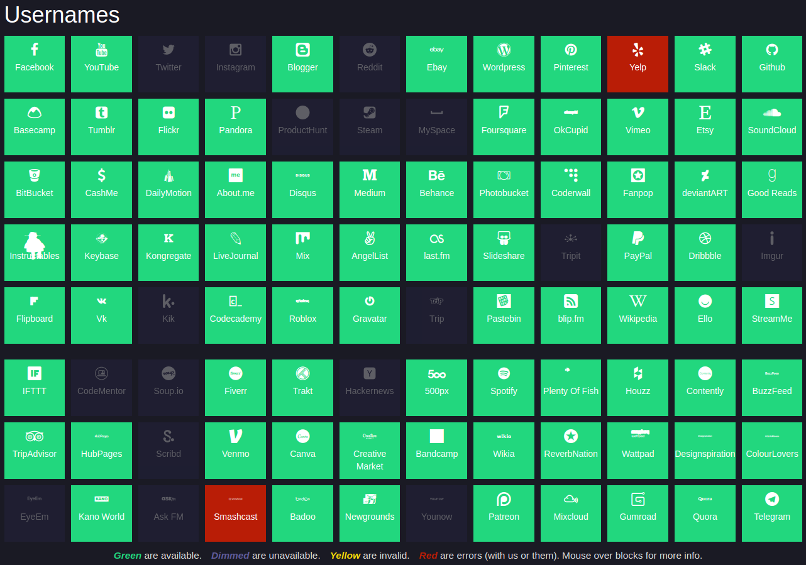
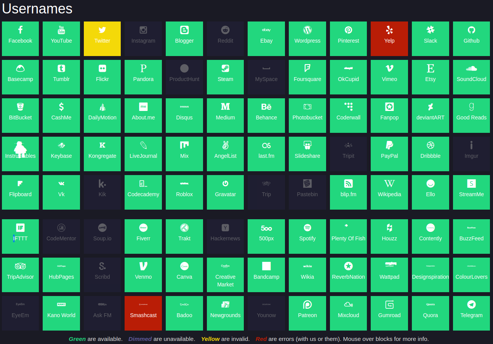

# ALIedAS About Some Thing

903 points

### Prompt

> See what you can find.

> `AUCTFShh`

> Author: c

### Solution

`AUCTFShh` looks like a username. To find where that username is in use, we can either check manually (as I started out doing), or use some tools from the [OSINT Framework Site](https://osintframework.com/). Specifically, I used `OSINT Framework` > `Username` > `Username Search Engines` > [`Namechk`](https://namechk.com/). 



I opened each of the greyed out sites in a tab, and looked through each for anything suspicious. The usual suspects (Twitter, Instagram, Reddit) were all blank (even on the Wayback Machine), so on further... 

The Steam account by the name of `AUCTFShh` [link](https://steamcommunity.com/id/AUCTFShh) [archive](http://archive.today/2020.04.06-023418/https://steamcommunity.com/id/AUCTFShh) shows that this user has aliased their user name to `youllneverfindmese`. Back to [Namechk](https://namechk.com/):



The first thing I noticed is the PasteBin account listed. Visiting it reveals that this user has one page [link](https://pastebin.com/qMRYqzYB) [archive](http://archive.today/2020.04.06-023833/https://pastebin.com/qMRYqzYB). It contains:

```
https://devs-r-us.xyz/jashbsdfh1j2345566bqiuwhwebjhbsd/flag.txt
```

The `devs-r-us.xyz` domain is part of another AUCTF challenge, so we know this is the right place to look. 

```
wget https://devs-r-us.xyz/jashbsdfh1j2345566bqiuwhwebjhbsd/flag.txt
cat flag.txt
auctf{4li4s3s_w0nT_5t0p_m3_6722df34df}
```

~Lyell Read