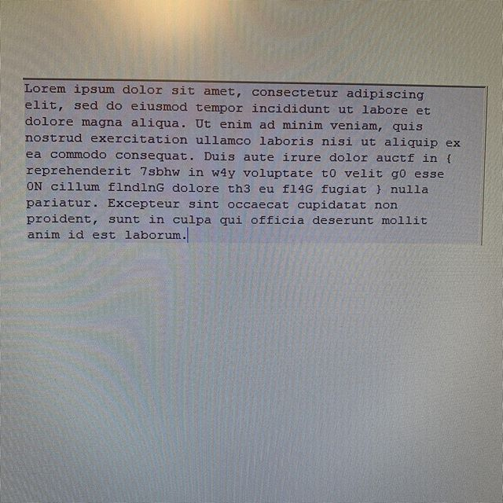

# OSINT You All Over The Place

A post-competition writeup; 983 points

### Prompt

I do not have access to the prompt, but the URL is `devs-r-us.xyz`

### Solution

After solving the first three challenges, I looked into this one. I investigated the website provided thouroughly, and found out the following:
- Images `mcofee.png` and `mcafee.png` are different, their difference contains some data and a discord link (applicable to Oryx, the last OSINT challenge).
- Loretta Mcintosh (with twitter handle @BackUpOrMcintoshYouOut) and Jorge Greenwood (@JorgeGreenwoodCodes), and two sites listed in Jorge Greenwood's Bio, all of which are dead ends on Wayback Machine and at the time of writing (facepalm.org was up for sale, and myworld.com was a corporate site).
- `dig devs-r-us.xyz +short`: `35.237.51.101`

This is where I got stuck when working through this challenge. I did not (stupidly) purse more info about the site itself, or who was responsible for hosting it. I wil next time, you can bet on that ;).

First, we pull the ICANN information about the site resulting in [this](icann.json).

That shows that the site is hosted by namecheap, so let's pull the namesheet data for that site too, and see if we can get more information about it. I queried https://www.namecheap.com/domains/whois/result?domain=devs-r-us.xyz and got [this](namecheap.txt).

That reveals the email of the registrant is `shannonengrid@gmail.com`, so we can infer that their name is Shannon Engrid. 

A Google search turns up first result of Shannon's linkedin profile [link](https://www.linkedin.com/in/shannon-engrid-07b0b01a2/detail/contact-info/) [archive](http://archive.today/2020.04.06-052058/https://www.linkedin.com/in/shannon-engrid-07b0b01a2/detail/contact-info/), which under "Contact Info" lists a twitter [link](https://twitter.com/SFelinefriend) [archive](http://archive.today/2020.04.06-052229/https://twitter.com/SFelinefriend), which in turn lists an instagram account [link](https://www.instagram.com/s.e.grid/) [archive](http://archive.today/2020.04.06-052233/https://www.instagram.com/s.e.grid/)

This in turn has a photo on it, which is of some text:



There is "auctf" and some leetspeak in there, but it is surrounded by (and split up by) the default sample text ("Lorem ipsum dolor sit amet"). We need to remove that, which I did manually (for each word after "auctf", if it is in the default text, do not count it in the flag) (based on [this](https://loremipsum.io/):

```
auctf{7sbhww4yt0g00Nf1nd1nGth3fl4G}
```