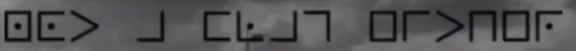
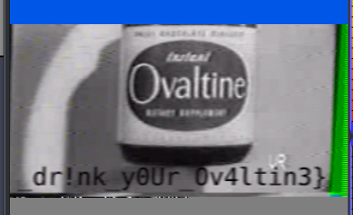
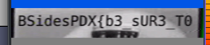

# BSidesPDX Down the Rabbit Hole

### Prompt

> Category: Over The Air
> 297 Points
> 5 Solves

During one of the commercial breaks of my favorite state sponsored educational video, there was some interference once again. There was a woman wearing some sort of face mask and there were strange tones. The tones were familiar and rang a bell, but I couldn't quite put my finger on them. I don't know what these things mean, but maybe you can figure it out.

[twitch.tv/over_the_air](https://twitch.tv/over_the_air)

Author(s): 0xdade & fdcarl

### Solution

This challenge is where we really... umm... go down the rabbit hole, you could say ;). I started by playing the whole video and noting all the oddities that I could find, and started working them out one by one: 

- [[00:00]](https://youtu.be/_QgPMyRBBKM) : Many QR codes on the standby screen (challenge 1, "please stand by")
- [[02:55]](https://youtu.be/_QgPMyRBBKM?t=175) : Creepy appearance behind the betty crocker advertisement.
- [[04:51]](https://youtu.be/_QgPMyRBBKM?t=291) : Sneezing guy repeated a couple times in quick succession.
- [[5:53]](https://youtu.be/_QgPMyRBBKM?t=353) : In the duck & cover / burt the turtle clip, there's a flag person in the bottom left that is sending text in the maritime flag signaling pattern.
- [[08:24]](https://youtu.be/_QgPMyRBBKM?t=504) : In the atomic bomb / duck & cover intro, when in Betty's school, a creepy plague doctor mask guy with numbers and letters, and a tune (challenge 2, "xclusive numborz")
- [[14:06]](https://youtu.be/_QgPMyRBBKM?t=846) : When Tony is going to cubscouts / picnic - creepy guy overlay w anonymous-like mask on.
- [[15:46]](https://youtu.be/_QgPMyRBBKM?t=946) : In the announcement about the Secret Squadron, `0x13A5C` is displayed, and a number is heard dialing in the background.
- [[17:21]](https://youtu.be/_QgPMyRBBKM?t=1041) : Giant Behemoth: A message appears on the top of the screen.

So, we eliminated or decoded one thing at a time, ommitting the parts from previous challenges:

- [[5:53]](https://youtu.be/_QgPMyRBBKM?t=353) : In the duck & cover / burt the turtle clip, there's a flag person in the bottom left that is sending text in the maritime flag signaling pattern.

The maritime / semaphore flag alphabet [is documented](http://www.anbg.gov.au/flags/semaphore.html), and I decoded the flag message to be two repetitions of:

- J and 'alphabetic' (LH out ; RH up)
- B and 2 (LH down; RH out)
- S (LH low; RH out)
- I and 9 (LH across low; RH up)
- D and 4 (LH down; RH up - or LH up; RH down)
- E and 5 (LH high; RH down)
- S (LH low; RH out)
- T (LH up; RH high)
- R (LH out; RH out)
- O (LH across high; RH out)
- L (LH high; RH low)
- O (LH across high; RH out)
- L (LH high; RH low)
- O (LH across high; RH out)
- L (LH high; RH low)
- O (LH across high; RH out)

To get result `BSIDESTROLOLOLOL`. Bummer, but at least we can cross off this lead for now.

- [[17:21]](https://youtu.be/_QgPMyRBBKM?t=1041) : Giant Behemoth: A message appears on the top of the screen.

The message on the top of the screen was decoded, as it was quickly identified to be the [pigpen cipher](https://en.wikipedia.org/wiki/Pigpen_cipher).



`not a flag either`

- [[15:46]](https://youtu.be/_QgPMyRBBKM?t=946) : In the announcement about the Secret Squadron, `0x13A5C` is displayed, and a number is heard dialing in the background.

Now things get more interesting. We have the tones associated with dialing a phone number, and a message on screen. The message reads `0x13A5C`, which is `80476` in decimal.

Decoding the phone dial presses is a matter of interpreting the [DTMF](https://en.wikipedia.org/wiki/Dual-tone_multi-frequency_signaling) tones. This requires first trimming the whole audio clip from the recording into [a clip of just the phone dial tones](dtmf.wav). This `.wav` file can then be put into [a dtmf decoder](https://github.com/ribt/dtmf-decoder), and it returns a phone number: `5038326682`. 

For this next part, I'll rely on what my teammates described, as I cannot call that number. However, when called, the caller is asked for a number. When provided with `80476`, the voice on the other end sounds out the following string of morse code:

```
-- ... --. -. ..- -- ....- .---- -.... ---.. ...--
```

When decoded, this turns into the string `MSGNUM41683`, which we initially did not know what to do with. `41683` is another 5-digit number, however, so let's just try calling `5038326682` back, and giving it our new number, shall we? 

More progress! The number speaks back `overtheair.space`. This link redirects us to [an unlisted YouTube video](https://www.youtube.com/watch?v=YcArof3MXx8) that contains more content similar to the twitch stream. In the middle of it, however, is a break, where loud beeping is heard that was instantly recognized to be [SSTV](https://en.wikipedia.org/wiki/Slow-scan_television). Now we need to decode that, and first that means downloading it...

> Given the tragic closure of the `youtube-dl` repository caused by RIAA, we almost resorted to [downloading the source code off twitter, and reconstituting the youtube-dl source code from that](https://archive.vn/VdmaG), however someone still had youtube-dl installed, and we successfully (allegedly, maybe) downloaded that video (see there is a good use for `youtube-dl`, RIAA). 

With that in hand, we extracted and trimmed the audio to [just the SSTV parts](captured_signals_sstv.wav), and then came the fun part. 

Following [an extremely thorough guide about how to decode this very kind of file](https://ourcodeworld.com/articles/read/956/how-to-convert-decode-a-slow-scan-television-transmissions-sstv-audio-file-to-images-using-qsstv-in-ubuntu-18-04), from Carlos Delgado, we successfully set up `qsstv`, a virtual audio cable (loopback so that audio can be played from computer into `qsstv`), and we were off to the races:

I was a bit slow to start it the first time, so I got the second half first:



... and the second part on the second run:



```
BSidesPDX{b3_sUR3_T0_dr!nk_y0Ur_Ov4ltin3}
```

~Lyell