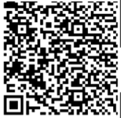
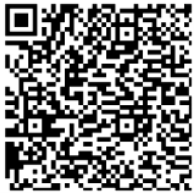
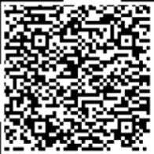
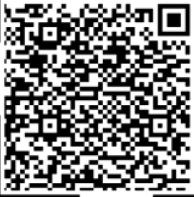

# BSidesPDX Please Stand By

### Prompt

> Category: Over The Air
> 263 Points
> 14 Solves

Sometimes I like to tune into the TV when no shows are on so I can watch the test pattern. I like to believe that there's a secret message hidden in the transmission.

[twitch.tv/over_the_air](https://twitch.tv/over_the_air)

Author(s): 0xdade & fdcarl

### Solution

This challenge is about the "Please Stand By" screen, presumably. Let's start by looking there. This screen is displayed during the first 2:09 of [the twitch stream(recording)](https://youtu.be/_QgPMyRBBKM)

Interesting, after about 1:20 of the usual standby screen, the screen displays an interference effect, then we see some QR code looking things appear in the top corners. 

These QR codes, however, are obviously incomplete, as evidenced by the fractional 'pixels' displayed where they meet the edges of the screen. This indicates that we're probably in for stitching these together...

Following that, we screenshotted each image. Here they are:






If we think about the regular format for QR codes, we would expect the "Position Patterns" (the square shaped sets of pixels) to be in the corners, so that informs us about the first orientation we should try.

In [Gimp](https://www.gimp.org/), we can stitch these together, and we get the following:


When scanned, that QR code becomes the text:

`B̴̡̋S̴̫͂i̷͎͘d̸̅́e̷͌̕s̴̓̈P̶͊̅D̸̑̽Ẍ̶́̑{̷̽́5̴̆͘t̴̒͘A̷͑͆n̸̏̈́d̴̶͗͂̄̑b̶͛͜Y̷̵̖̤̓̇f̵̽͛0̷̾̓r̸̵̛͎͝͝Ã̵̚n̸̶̮̏͑͒!̶́̔m̸̍̋p̵̊̇0̴̆͠r̵͂́ẗ̴̔a̶̒̽n̴̈́͒7̴̎̔_̸͆̾M̵̗̑ĕ̷̈́5̵̊͂5̴̊͂a̶͔͝G̷̉̕ë̸́͐}̷͉̚`

With a little reading, we can get the flag:

```
BSidesPDX{5tAnd_bY_f0r_An_Imp0rtan7_Me55aGe}
```

~Lyel