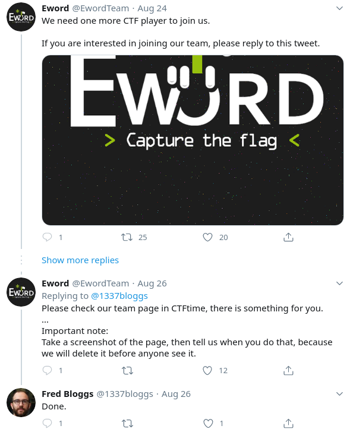
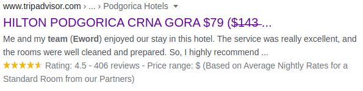
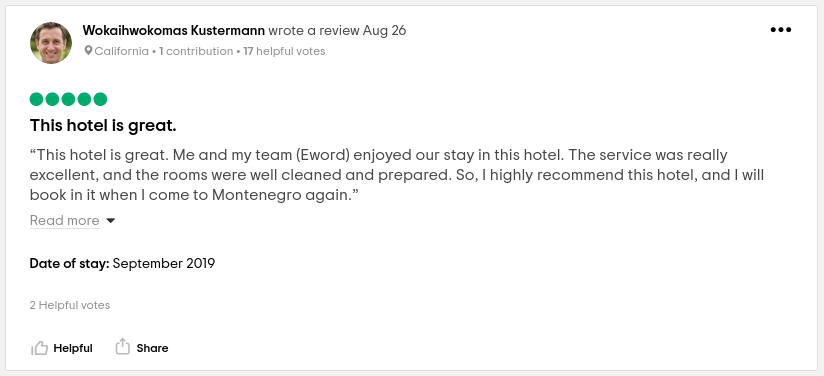
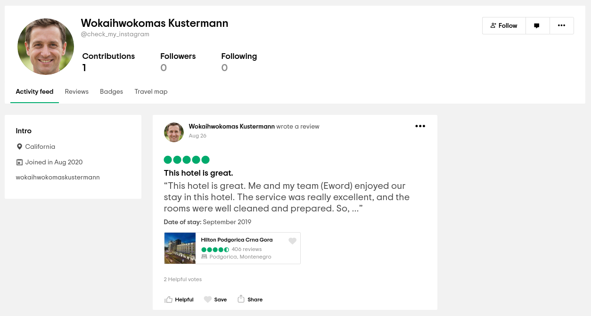
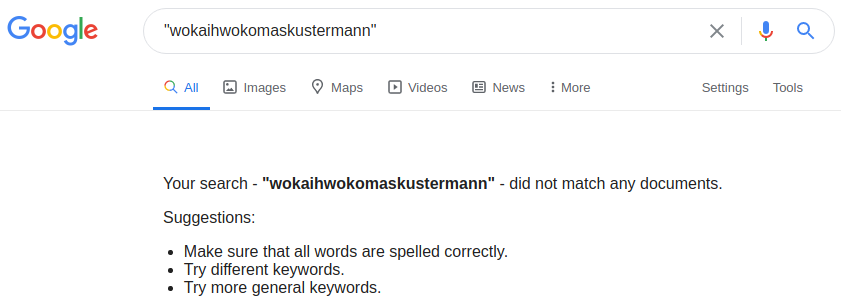
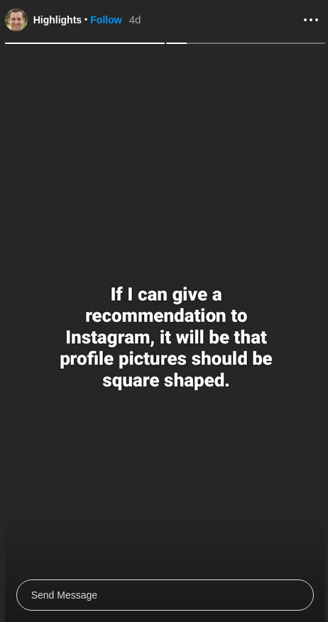

# Identity Fraud

> Points: 419
> Solves: 86
> Category: OSINT

### Prompt

> Someone stole our logo and created a team named "Eword". In order to find him, I created a fake twitter account (@1337bloggs) to join Eword team. Fortunately, they replied to the fake account and gave me a task to solve. So, if I solve it, they will accept me as a team member. ... Can you help me in solving the task?

> Flag Format: Eword{}

### Solution

We start at the twitter page of the account mentioned in the challenge description: [@1337bloggs](http://archive.today/2020.08.31-140505/https://twitter.com/1337bloggs/with_replies), and we are greeted with this tweet:



This indicates that at some point (around 8/26/2020), Eword had something on their CTFTime page. Over to the Wayback Machine! It shows two captures in 2020, 08/26 and 08/27. Let's view [the 08/26 capture](https://web.archive.org/web/20200826195056/https://ctftime.org/team/131587) - it appears to link to a PasteBin:

[This pastebin](https://pastebin.com/8bk9qLX1) reads:

```
Hi Fred,
 
You said that you are good in OSINT. So, you need to prove your skills to join Eword.
 
Your task:
Find the leader of Eword, then find the flag in one of his social media accounts.
 
Hint:
https://pastebin.com/PZvaSjA0
```

Clearly we have to find the leader of Eword (we'll get to that in a second), but we inspect this [new pastebin](https://pastebin.com/PZvaSjA0) first. It contains a bunch of what looks to be base64 data, so we put it into [cyberchef](https://gchq.github.io/CyberChef) and get this image out:


It shows us a Hilton hotel somewhere, and the size of the image is `1080X2094` - an unfamiliar resolution to me, so I googled it up, and it appears that this is a resolution used by Instagram. I also tried using Google Image reverse search to locate the hotel, however I was unsuccessful there, too, not that it would have helped too much.

> Note: if Instagram stories were indexed in a reverse image search engine like Google reverse image search, or TinEye, you would be able to jump to the end of the challenge using this information (instagram, photo), however I tried this and could not get success at the time. 

So we are looking for something that has to do with a Hilton and Eword Team, let's use Google: when we search for `"Hilton" "Eword" "team"`, we are greeted with a review for a Hilton in Podgorica, Montenegro:



Clicking that link gives us a tripadvisor page where we can search for that review with `Ctrl + F`



Looking further into that user, it's clear what we have to do:



We need to check the instagram of Wokaihwokomas Kustermann, which will likely be under the name he has in the Intro section, `wokaihwokomaskustermann`. Notably, you cannot just search for the username in google:



Instead, you will need to go to log in to instagram first, then search for the username, and [the account indeed shows up](https://www.instagram.com/wokaihwokomaskustermann/). There are a couple "Highlights", the first of which is the hotel image we got earlier, the second says:



Well, that seems indicative that we need to get the original image behind the circular profile pic (the other picture on their instagram is not the same as their profile pic), and we do that with a bit of inspect element and a `wget` request to save it:


There's very obviously a flag along the bottom (or some other writing), however it is too low res to read. Instead of figuring out how to make a properly formed request to Instagram's `cdn` servers, I used a tool called [instadp](https://www.instadp.com) to get [a full sized display picture](https://www.instadp.com/fullsize/wokaihwokomaskustermann):


That's all there is to it! 

```
Eword{c0ngraAatulationZzZz_aNd_w3lCom3_to_Eword_Team_!}
```

~Lyell Read