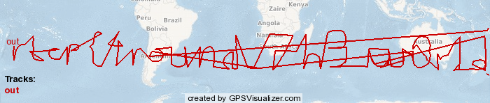

# Catography Writeup

### Prompt

> Jubie's released her own collection of cat pictures. Go check it out!

> http://challs.houseplant.riceteacatpanda.wtf:30002

> Note: The Unsplash author credit is not a part of the challenge, it's only there to conform with the Unsplash image license.

> Dev: jammy

### Solution

Browsing the site, we can see that it is a collection of cat images... A lot of them. From inspecting the sources, we can see that these images are pulled from an API at http://challs.houseplant.riceteacatpanda.wtf:30002/api. There are 83 'pages'.

We then used [this script](get_all_cats.sh) to grab all image ID's, then get all images based on those ID's. These images are stored here: [all_cats.tar.gz](all_cats.tar.gz). 

Upon further examination of those cat photos, `exiftool` returns some interesting info about each file:

```bash
$ exiftool 002c3599-572f-4d23-8fd2-3eb8b3073ab5.jpg
ExifTool Version Number         : 11.65
File Name                       : 002c3599-572f-4d23-8fd2-3eb8b3073ab5.jpg
Directory                       : .
File Size                       : 136 kB
File Modification Date/Time     : 2020:04:26 02:59:52-07:00
File Access Date/Time           : 2020:04:26 03:20:46-07:00
File Inode Change Date/Time     : 2020:04:26 02:59:52-07:00
File Permissions                : rw-r--r--
File Type                       : JPEG
File Type Extension             : jpg
MIME Type                       : image/jpeg
XMP Toolkit                     : Image::ExifTool 10.80
GPS Latitude                    : 29 deg 59' 34.81" S
GPS Longitude                   : 169 deg 42' 47.97" W
Image Width                     : 1080
Image Height                    : 811
Encoding Process                : Baseline DCT, Huffman coding
Bits Per Sample                 : 8
Color Components                : 3
Y Cb Cr Sub Sampling            : YCbCr4:2:0 (2 2)
Image Size                      : 1080x811
Megapixels                      : 0.876
GPS Latitude Ref                : South
GPS Longitude Ref               : West
GPS Position                    : 29 deg 59' 34.81" S, 169 deg 42' 47.97" W
```

We see that it has some geotag information! Let's get all that out, and see if all the images have that. After working on a python script to do that, I found that `exiftool` will do that! https://exiftool.org/geotag.html

```bash
$ exiftool -fileOrder gpsdatetime -p gpx.fmt /path/to/all_cats > out.gpx
```

Now, using [this online tool](https://www.gpsvisualizer.com/map?output_home) we can output this data as a png, and interpret the flag from the path:



```
rtcp{4round_7h3_w0r1d}
```

~ Aaron Esau, Lyell Read