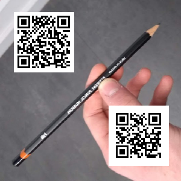

# Satan's Jigsaw Writeup

### Prompt

> Oh no! I dropped my pixels on the floor and they're all muddled up! It's going to take me years to sort all 90,000 of these again :(

> Dev: Tom

> Hint! long_to_bytes

File: [chall.7z](chall.7z)

### Solution

This provided archive contains 90,000 JPEG's. I extracted all of them to `./images` (relative to this README's PWD). Each of these images has a size of 1 pixel. 

Then, comes the fun part. Before reading the hint, I tried just forming the image from the pixels in the order that they appeared in the folder, but this revealed a 'static' image.

The hint makes obvious that we must convert the decimal part of the filename to bytes, but it does not explain what to do with those. However, after trying it out, we saw that the he decoded filenames contain an X and Y 'coordinate' in the format "X Y". Decoding all this, sorting, and making an image is all achieved in the script [image_reconstruct.py](image_reconstruct.py).



The top left QR code was essential to solving the challenge, however the bottom right one contains the flag.

```
rtcp{d1d-you_d0_7his_by_h4nd?}
```

~ Lyell Read