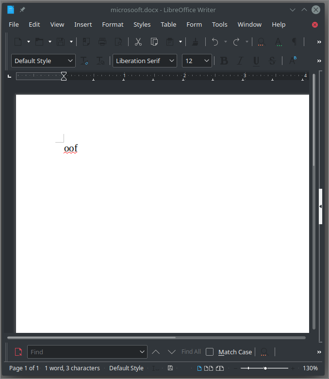
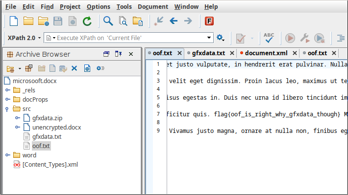

# Microsooft

100 points

### Prompt

> We have to use Microsoft Word at the office!? Oof...

> Download the file below.

[File](microsooft.docx)

### Solution

Opening the file does not do much, but it would not be that easy.



Using `file` we can find out that this is an OOXML document:

```
$ file microsooft.docx 
microsooft.docx: Microsoft OOXML
```

Based on this, and [some quick reading](https://ntnuopen.ntnu.no/ntnu-xmlui/bitstream/handle/11250/198656/EDidriksen.pdf?sequence=1), we can see that this format can contain files. To view these files, I first tried [this chrome extension](https://chrome.google.com/webstore/detail/ooxml-tools/bjmmjfdegplhkefakjkccocjanekbapn?hl=en), before settling on getting a trial licensed version of [OxygenXML](https://www.oxygenxml.com/). Opening it in here, and viewing the file `src/oof.txt` gives us the flag:



```
flag{oof_is_right_why_gfxdata_though}
```

~ Lyell