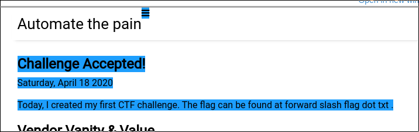

# Time Keeper

50 points

### Prompt

> There is some interesting stuff on this website. Or at least, I thought there was...

> Connect here:
https://apporima.com/

> Note, this flag is not in the usual format.

### Solution

After scoping out that site, the title and description heavily hint towards use of the Wayback Machine. Over there we head, then. 

First, I noted that there were only two captures, so I figured it would be worth it to compare them. In doing so, I came upon [this](https://web.archive.org/web/diff/20200509205430/20200418214642/https://apporima.com/):



It clearly indicates that we need to browse to `apporima.com/flag.txt` but in current times, that page does not exist. What else to do but browse it in the Wayback Machine? It gives us [this page](https://web.archive.org/web/20200418213402/https://apporima.com/flag.txt).

```
JCTF{the_wayback_machine}
```

~ Lyell


