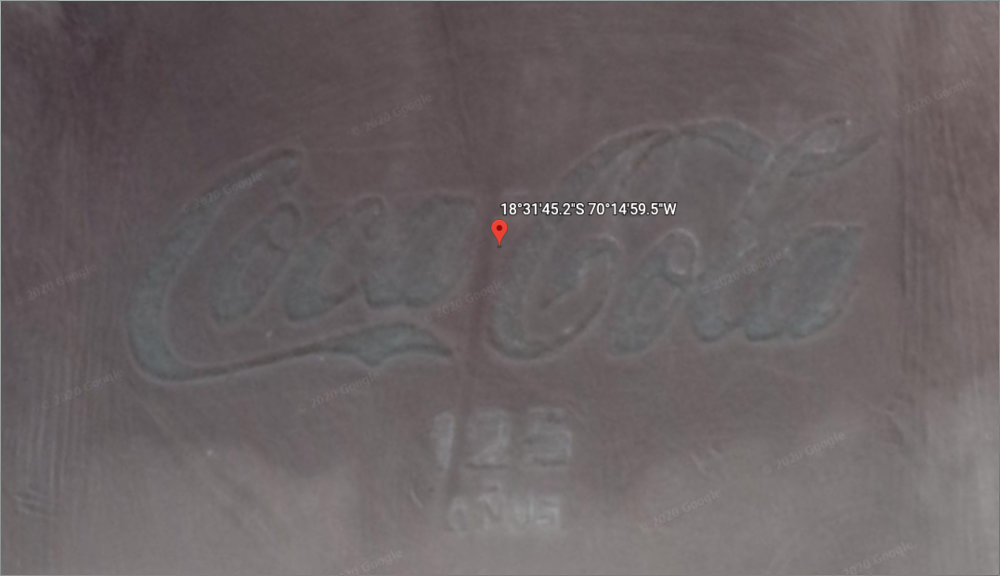

# GEOGRAPHY Writeup

### Prompt

My friend told me that she found something cool on the Internet, but all she sent me was 11000010100011000111111111101110 and 11000001100101000011101111011111.

She's always been a bit cryptic. She told me to "surround with gigem{} that which can be seen from a bird's eye view"... what?

### Solution

Ok. We know that we need to somehow interpret those binary strings as coordinate(s) to get a location that we can look at from "bird's eye view" (presumably on Google Maps). 

I went through many trials of this, from converting the bits to { string, hex, decimal, octal } and using those as coordinates, and calculating geohashes { http://geohash.co/, https://www.dcode.fr/geohash-coordinates } to get locations out of these things, all to end up with locations in the Pacific or in Russia or Antarctica, with nothing at all there. Coincidentally, I was sure that each set of bits corresponded to a *pair* of coordinates (latitude and longitude), so I would get a line that I needed to read along (or something) between those points, from a "bird's eye view". 

OK, those were wrong, so back to basics. I googled 
"binary string length 32 coordinates geographical", leading me to [this article](https://www.thethingsnetwork.org/forum/t/best-practices-when-sending-gps-location-data-howto/1242). In it, user `arjanvanb` describes:

> In decimal degrees, a longitude with 4 decimals, -180.0000…+180.0000 might need 9 bytes when sending as plain characters (or 8 when leaving out the decimal dot), and probably another byte for some separator. But it also nicely fits in 3 bytes (like -8,388,608 to 8,388,607 as a 24 bit signed integer if you first multiply by 10,000). When one needs more decimals, using 4 bytes for a standard 32 bit float [59], or multiplying by 100,000 and sending as a standard 32 bit signed long [41], will give more than 7 decimals.

Thank you, Arjan! From that, I tried converting these 32-bit binary strings into floats using [IEEE 754 Converter](https://www.h-schmidt.net/FloatConverter/IEEE754.html) and I got: 

```
11000010100011000111111111101110 : -70.24986
11000001100101000011101111011111 : -18.529234

```

When ordered (-70.24986, -18.529234), we get [this spot](https://earth.google.com/web/@-70.24986,-18.529234,72.67408088a,328.68889373d,35y,0h,45t,0r/data=CjkaNxIxCgAZByXMtP2PUcAhZ-4h4XuHMsAqGzcwwrAxNCc1OS41IlMgMTjCsDMxJzQ1LjIiVxgCIAEoAg), in the middle of the ocean, above Antarcitca... Nothing doing.

However, when ordered the other way, (-18.529234, -70.24986), we come across [this spot](https://earth.google.com/web/@-18.52933711,-70.24988924,174.8925544a,155.32728959d,35y,23.907023h,18.45174211t,360r), at 18°31'45.2"S, 70°14'59.5"W. 



Thanks to the TAMUCTF organizers for being reasonable and providing the flag once I proved I got the right location, as I would have had to try a bunch of possibilities:

```
gigem{CocaCola125anos}
gigem{cocacola125anos}
gigem{coca-cola-125-anos}
gigem{Coca-Cola-125-anos}
...
```

To get the flag:

```
gigem{coca-cola}
```

~Lyell Read
