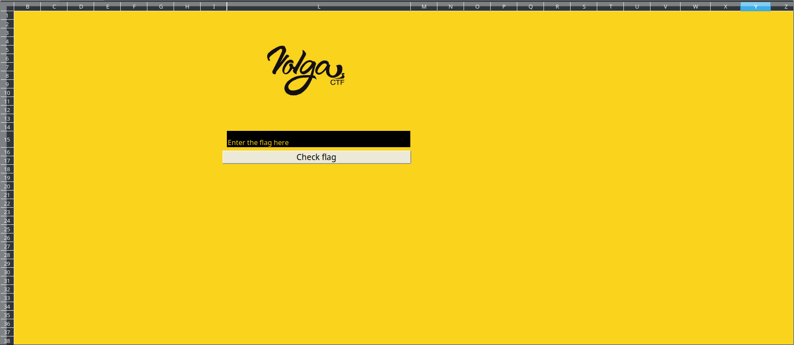
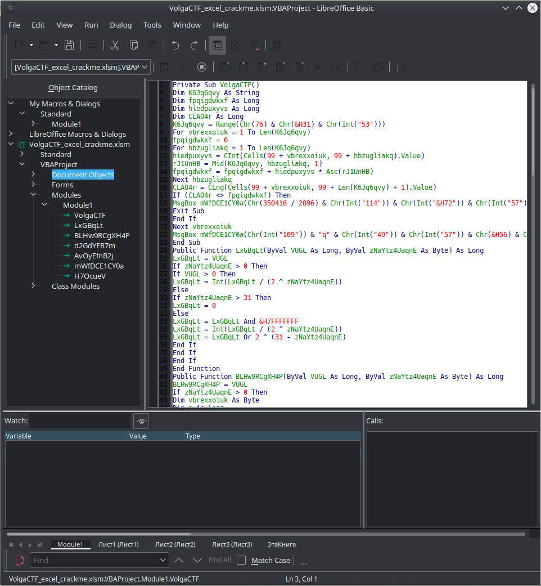
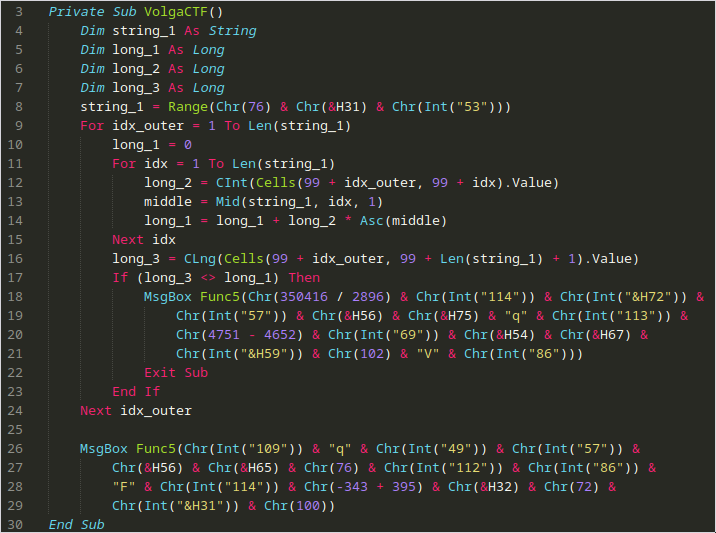
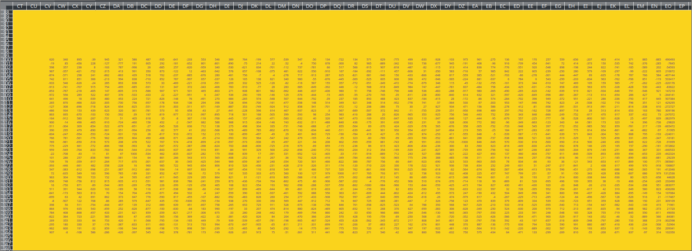

# excellent-crackme Writeup

### Prompt

Excellent Crackme
We know one can do pretty much everything in Excel spreadsheets, but this...

[excel_crackme](VolgaCTF_excel_crackme.xlsm)

### Solution

An excel challenge - that's a first for us! Let's crack that file open. We used LibreOffice, as Excel was not installed and Libreoffice was. Upon opening, we are greeted with a message that mentions that macros will not be run for security reasons. we'll look into that in a sec, thank you, LibreOffice. 

Firstly, let's look at the spreadsheet:



Nice colors. We see an entry box, and what looks like a submit box. The first thing we did was select all cells, and change text color to not yellow, on a hunch that there is hidden text or data somewhere in the sheet. There is, though we did not find it at first.

Under `Tools` > `Macros` > `Edit Macros`, we can see the following:



This looks like slightly obfuscated VPA (Visual Basic for Applications). On further inspection, it appears that everything listed under `Module1` is the same file, just different functions. Therefore, we extract `VolgaCTF` into [VolgaCTFRaw.bas](VolgaCTFRaw.bas). 

Then, we began manually deobfuscating it, renaming variables and indenting appropriately. We needed not get further than the first function (*fine*, subroutine) `VolgaCTF()` to undstand what is going on. Here is that function (deobfuscated):

```basic
Private Sub VolgaCTF()
	Dim string_1 As String
	Dim long_1 As Long
	Dim long_2 As Long
	Dim long_3 As Long
	string_1 = Range(Chr(76) & Chr(&H31) & Chr(Int("53")))
	For idx_outer = 1 To Len(string_1)
		long_1 = 0
		For idx = 1 To Len(string_1)
			long_2 = CInt(Cells(99 + idx_outer, 99 + idx).Value)
			middle = Mid(string_1, idx, 1)
			long_1 = long_1 + long_2 * Asc(middle)
		Next idx
		long_3 = CLng(Cells(99 + idx_outer, 99 + Len(string_1) + 1).Value)
		If (long_3 <> long_1) Then
			MsgBox Func5(Chr(350416 / 2896) & Chr(Int("114")) & Chr(Int("&H72")) & Chr(Int("57")) & Chr(&H56) & Chr(&H75) & "q" & Chr(Int("113")) & Chr(4751 - 4652) & Chr(Int("69")) & Chr(&H54) & Chr(&H67) & Chr(Int("&H59")) & Chr(102) & "V" & Chr(Int("86")))
			Exit Sub
		End If
	Next idx_outer

	MsgBox Func5(Chr(Int("109")) & "q" & Chr(Int("49")) & Chr(Int("57")) & Chr(&H56) & Chr(&H65) & Chr(76) & Chr(Int("112")) & Chr(Int("86")) & "F" & Chr(Int("114")) & Chr(-343 + 395) & Chr(&H32) & Chr(72) & Chr(Int("&H31")) & Chr(100))
End Sub
```

This can be better understood with [VBScript syntax highlighting](https://github.com/SublimeText/VBScript):



Firstly, some local variables are defined (`long_1`, `long_2`, `long_3`). Then `string_1` is set to the `Range()` of `Chr(76) & Chr(&H31) & Chr(Int("53"))`. This becomes `Range("L" & "1" & "5")` (note that `&H31` == `0x31` and elsewhere, the `&` operator is concatenation). Therefore, this becomes `Range(L15)` - this is where the text is entered in the Excel sheet, so `string_1` is the user input.

Therefore, the outer loop iterates over the length of user input. We then identified that the first call to `MsgBox` is the one that issues the failure message, and the final one was the success message. We only fail if `long_3 != long_1`. 

`long_1` is set by repeating for each character in input string, adding the value of the cell at `99 + idx_outer, 99 + idx` multiplied by the ascii value of the current character (at `idx`). 

`long_3` is set by `long_3 = CLng(Cells(99 + idx_outer, 99 + Len(string_1) + 1).Value)` which takes the value of cell `99 + idx_outer, 99 + Len(string_1) + 1`. Knowing this, we looked at what data is in the sheet around 100,100:



The last column is the 'vector' while the rest is the 'matrix'. The code is essentially taking the dot product of the two. We can undo the operations done, and get the ascii value of the characters of the flag by performing `matrix\vector` in `sage`. [Here is the sage script](excellent-crackme-solve.sage).

```
VolgaCTF{7h3_M057_M47h_cr4ckM3_y0u_3V3R_533N}
```

~Lyell Read, Phillip Mestas, Lance Roy
